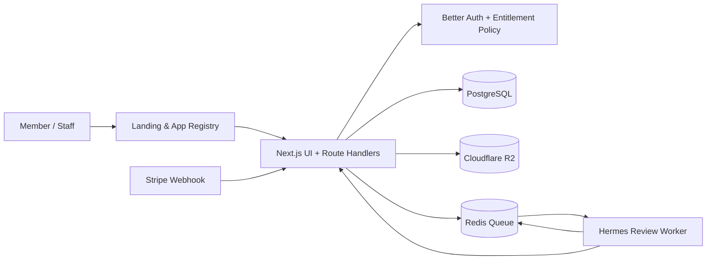

# Initial Architecture

## Runtime topology

Vercel hosts pilot deployments of the Next.js application. Production migrates the Next.js standalone container, Redis-compatible queue and isolated Hermes container to Hostinger VPS. PostgreSQL and R2 boundaries are consistent across both targets.

## Route families

| Route family | Access | Initial responsibility |
|---|---|---|
| `/` | public/member | landing, app registry, enterprise quotation request |
| `/apps/estimeter/*` | entitled member | ESTIMETR engineering workspaces |
| `/apps/rcopt/*` | member free | registry target; source revision later |
| `/apps/traffic-sign/*` | member free | registry target; source revision later |
| `/apps/land-acquisition/*` | DOH staff only | controlled link/boundary; no legacy migration now |
| `/api/*` | policy guarded | Better Auth callbacks, server actions/route handlers, queue/webhook boundaries |

## Design constraints

Each ESTIMETR route maps to an explicit work step rather than a broad dashboard. The primary flow remains project setup → drawing and scale → takeoff/evidence review → prelim BOQ → price set → document projection → quality gate/output. AI result is always advisory until a user review/approval action.

## Adapter boundaries

| Boundary | Interface responsibility | Pilot implementation | Production implementation |
|---|---|---|---|
| Database | transaction, migration, repository | PostgreSQL connection | PostgreSQL 16 on VPS |
| Object storage | private upload/download signed access | Cloudflare R2 | Cloudflare R2 |
| Background queue | typed job lifecycle | managed/dev queue adapter | Redis-compatible queue on VPS |
| Agent review | evidence snapshot → advisory finding | disabled/mock-safe adapter | isolated Hermes container |
| Billing | verified event → entitlement state | test mode only | Stripe verified webhook |

## Security boundaries

The browser never calls Hermes, Stripe secret endpoints, R2 admin APIs or price source credentials directly. Entitlement policy executes on the server. Hermes uses a least-privilege service API and cannot mutate business data. Public quotation intake is rate limited and consent-recorded.
